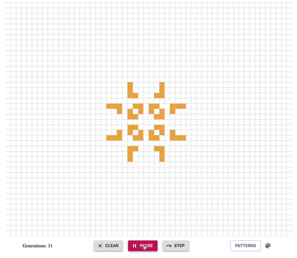

# Game of Life

This version of John Conway's [Game of Life](https://en.wikipedia.org/wiki/Conway%27s_Game_of_Life) was built with React and offers a library of famous prebuilt patterns to experiment with in addition to allowing you to discover your own. Have fun changing the cell colors too!

## The Rules

The basic principle is that from generation to generation, a dead cell comes to life if it has exactly 3 live neighbors and a living cell dies if it has more than 3 live neighbors (overcrowding) or less than 2 live neighbors (loneliness). That's it! Theoretically, the board is infinite. This board is 100 x 100 cells with cells beyond that area being considered dead.

## Running the project

In the project directory, you can run `npm i` to install dependencies and then `npm start` to launch the game at localhost:3000.
